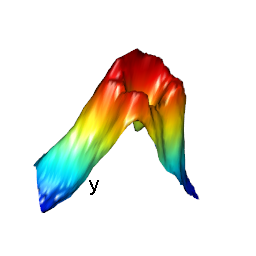

```{echo = FALSE, include = FALSE}
output: rmarkdown::html_vignette
  \usepackage[T1]{fontenc}
```

```{r, include = FALSE, message=FALSE}
knitr::opts_chunk$set(echo = TRUE)
require(plot3Drgl)
```


# Introduction

The R-package *plot3D* provides functions for plotting 2- and 3-D data, using R base graphics.

Package *plot3Drg*l allows to plot these functions also in openGL, 
as made available by package *rgl*.

One way to use openGL is to first create a plot in base R-graphics using plot3D functiona, 
and then use function *plotrgl()* to depict the same figure in rgl. 

The main advantage of rgl over base graphics is that it allows to interactively rotate, zoom, and shift the graphics,
and even select regions.

A related package that depends on *plot3Drgl* is R-package *OceanView*
which contains functions for visualing oceanographic data.


# Function plotrgl

Typically you can start by making a 3D plot using functions from package *plot3D*.
Although not necessary, plotting can be postponed by setting argument *plot = FALSE*

```{r, fig.show="hide"}
persp3D(z = volcano, plot = FALSE)
```

The figure is then plotted in openGL by function *plotrgl*, whose arguments are:

```{r}
args(plotrgl)
```

Here the *...* are any parameter that would be passed to *rgl* functions
*par3d*, *open3d* or *material3d* (see documentation in the rgl package).

In the code below, argument \emph{smooth} adds Gouraud shading, while \emph{lighting} adds a light source.

```
plotrgl(smooth = TRUE, lighting = TRUE)
```

```{r volcanorgl, echo=FALSE, fig.cap="The volcano plot in rgl", out.width = '60%'}
knitr::include_graphics("volcanorgl.png")
```

Now you can use the left mouse key to rotate the plot, the middle mouse key to move it,
and the right key to zoom. You may also want to try function *cutrgl*,
which allows to cut parts of the plot. This however only works if there is no color key.


An alternative, shorter version to do the same is:

```
persp3Drgl(z=volcano, smooth=TRUE, lighting=TRUE, colkey=FALSE)
```

```{r figurename, echo=FALSE, fig.cap="The volcano plot in rgl after a region was cut", out.width = '60%'}

```

\newpage

# scatter plot example
A linear regression of the mtcars data can be easily plotted both in base graphics and using rgl:

```{r}
attach(mtcars)
fit <- lm(mpg ~ wt + disp)

# predict values on regular xy grid
wt.pred <- seq(1.5, 5.5, length.out = 30)
disp.pred <- seq(71, 472, length.out = 30)
xy <- expand.grid(wt = wt.pred,
                  disp = disp.pred)

mpg.pred <- matrix (nrow = 30, ncol = 30,
    data = predict(fit, newdata = data.frame(xy),
    interval = "prediction")[,1])

# fitted points for droplines to surface
fitpoints <- predict(fit)
```

```{r, fig.width=6, fig.height=6, fig.cap="The mtcars fit in base R"}
scatter3D(z = mpg, x = wt, y = disp, colvar = abs(mpg - fitpoints),
      pch = 18, cex = 2, theta = 20, phi = 20, ticktype = "detailed",
      xlab = "wt", ylab = "disp", zlab = "mpg", main = "mtcars",
      clab = "error", zlim = c(5, 35),
      surf = list(x = wt.pred, y = disp.pred, z = mpg.pred,
      facets = NA, border = "black", fit = fitpoints)
      )
```

```{r}
detach(mtcars)
```

```
plotrgl()
```

```{r mtcarsrgl, echo=FALSE, fig.cap="The mtcars fit in rgl", out.width = '60%'}
knitr::include_graphics("plot3Drglfit_rgl.png")
```

\newpage

# isosurfaces

Function *isosurf3D* from package *plot3D* creates surfaces of equal scalar
value from a volumetric data set. 

It makes use of a function from package *misc3d*(Feng and Tierney, 2008) .

If we depict several isosurfaces, it is best to use transparent colors by setting
argument *alpha* smaller than 1. Plotting transparent surfaces is very slow in
base graphics, but not so in openGL.

```{r, fig.width=6, fig.height=6, fig.cap="The isosurface plot in base R"}
 x <- y <- z <- seq(-2, 2, length.out = 15)
 xyz <- mesh(x, y, z)
 F <- with(xyz, log(x^2 + y^2 + z^2 +
                10*(x^2 + y^2) * (y^2 + z^2) ^2))

# three levels, transparency added
 isosurf3D(x, y, z, F, level = seq(0, 4, by = 2),
   col = c("red", "blue", "yellow"),
   clab = "F", alpha = 0.2)
```

```
plotrgl()
```

```{r isosrgl, echo=FALSE, fig.cap="The isosurface plot in rgl", out.width = '60%'}
knitr::include_graphics("plot3Drgliso_rgl.png")
```

\newpage

# Issues

* Sometimes the axes are not drawn in rgl plots.
  If you want axes, just type
```
decorate3d()
```
* The package contains a function to visualise arrows in rgl as cones.
  But it has a flaw, as the arrows are distorted,
  if not perpendicular to the z-axis. Use with care

## References
Duncan Murdoch and Daniel Adler (2021). rgl: 3D Visualization Using OpenGL. R package
  version 0.108.3. https://CRAN.R-project.org/package=rgl
  
Feng D, Tierney L (2008). "Computing and Displaying Isosurfaces in R." Journal of Statistical
Software, 28(1). URL http://www.jstatsoft.org/v28/i01/.

Karline Soetaert (2021). plot3D: Plotting Multi-Dimensional Data. R package version
  1.4. https://CRAN.R-project.org/package=plot3D
 
Karline Soetaert (2022). plot3Drgl: Plotting Multi-Dimensional Data - Using 'rgl'. R
  package version 1.0.3. https://CRAN.R-project.org/package=plot3Drgl
  
Karline Soetaert (2021). OceanView: Visualisation of Oceanographic Data and Model
  Output. R package version 1.0.6. https://CRAN.R-project.org/package=OceanView  

## Affiliation:
Karline Soetaert

Royal Netherlands Institute of Sea Research (NIOZ)

4401 NT Yerseke, Netherlands

E-mail: karline.soetaert@nioz.nl
URL: http://http://www.nioz.nl

